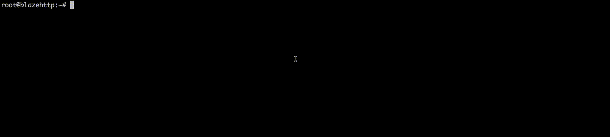

<h1 align="center">最好用的 WAF 测试工具</h1>
<p align="center">
  
</p>


## 测试指标
|  指标   | 描述  | 统计方法  |
|  ----  | ----  | ----  |
| 检出率  | 用来反应 WAF 检测能力的全面性，没有检出即为 ”漏报“。 | 攻击样本拦截数量  |
| 误报率  | 用来反应对正常流量的干扰，不靠谱的结果即为 ”误报“。 | 正常样本拦截数量 |
| 准确率  | 准确率是检出率和误报率的综合指标，避免漏报和误报顾此失彼。 |  |
| 检测耗时  | 用来反应 WAF 性能，耗时越大则性能越差。 |  |

## 🚛 下载代码

``` bash
git clone https://github.com/chaitin/blazehttp.git && cd blazehttp
```

## 🚀 一键运行

``` bash
bash build.sh && ./build/blazehttp -t http://127.0.0.1:8008
```

## 🕹️ 靶机服务

``` bash
docker run -d -p 8080:80 --name hello_waf -d co0ontty/hello_waf:latest
```
